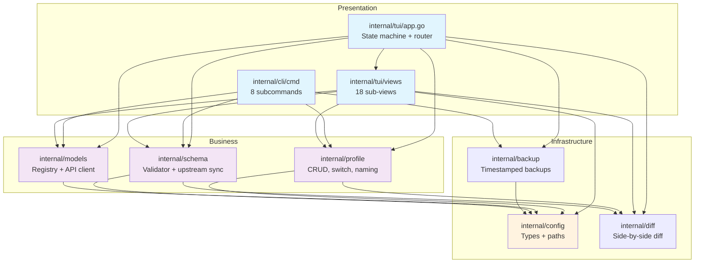

# omo-profiler Architecture

**Generated:** 2026-05-11
**Source:** GitNexus Knowledge Graph (4,249 nodes, 17,129 edges, 102 clusters, 236 flows)

---

## Overview

`omo-profiler` is a TUI profile manager for `oh-my-openagent` configuration files. Built in Go 1.25.6, it combines a Bubble Tea terminal UI with a Cobra CLI, managing profile CRUD, active-state switching, and JSON schema validation against an upstream spec.

The architecture follows a **layered, message-driven design** with three primary layers:

1. **Presentation** (`internal/tui/` + `internal/cli/`) — Bubble Tea views and Cobra commands
2. **Business Logic** (`internal/profile/`, `internal/models/`, `internal/schema/`) — CRUD, switching, validation, model registry
3. **Infrastructure** (`internal/config/`, `internal/diff/`, `internal/backup/`) — path resolution, diff computation, backup rotation

---

## Functional Areas (Knowledge Graph Communities)

| Area | Symbols | Cohesion | Role |
|--------|---------|----------|------|
| **Views** | ~400+ | 0.38–0.92 | 18 Bubble Tea sub-views (wizard steps, dashboard, list, diff, import, export, models, schema check) |
| **Profile** | 33 | 0.69–0.76 | Profile CRUD, active-state management, naming validation, sparse-field detection |
| **Config** | 17 | 0.76 | Schema authority — `Config` struct (38 top-level fields), path resolution, `SetBaseDir` test isolation |
| **Schema** | 15 | 0.88 | Embedded JSON schema validator (`gojsonschema` singleton), upstream drift detection |
| **Tui** | 14 | 0.90 | Root `App` model — state machine, message router, global overlays (toast, help, spinner) |
| **Diff** | 14 | 0.96 | Side-by-side + unified diff computation (`go-diff` wrapper) |
| **Backup** | 14 | 0.76 | Timestamped backup rotation before profile switch |
| **Models** | 14+ | 0.82 | Local model registry CRUD + `models.dev` API client |
| **Cmd** | 12 | 0.85 | Cobra subcommands (`list`, `switch`, `import`, `export`, `create`, `models`, `schema-check`) |
| **Cli** | 8 | 0.80 | Root command registration, TUI-as-default `Run` behavior |

> **Note:** `Views` is heavily fragmented into ~20 sub-communities because the 18 view files each have tight internal cohesion but loose coupling between each other. This is intentional — each view is an independent Bubble Tea model.

---

## Module Dependency Graph



**Key dependency patterns:**
- **All business logic depends on `config`** — `Config` is the universal data contract
- **TUI is the orchestration hub** — `App` dispatches to all business packages via `tea.Cmd`
- **CLI is thin** — commands delegate directly to `profile`/`backup`/`models`/`schema`
- **`diff` is a utility** — used by both `profile` (sparse detection) and `schema` (upstream drift)

---

## Key Execution Flows

### 1. Profile Switching (`doSwitchProfile`)

**Trigger:** User selects "Switch" in List view → `App` emits `doSwitchProfile` `tea.Cmd`

```
App.doSwitchProfile (tui/app.go)
  → profile.SetActive (profile/active.go)
      → profile.Load (profile/profile.go)          — read profile JSON
      → collectFieldPresence (profile/profile.go)  — detect sparse fields
      → collectFieldPresenceFromRaw
      → selectionPathCandidates (profile/profile.go)
      → joinSelectionPath (profile/sparse.go)
  → backup.Create (backup/backup.go)              — rotate backup before overwrite
  → config.ConfigDir / ProfilesDir (config/paths.go) — path resolution
```

**Cross-community:** Tui → Profile → Backup → Config  
**Critical constraint:** Switching uses **COPY**, not symlinks (fsnotify compatibility).

---

### 2. Active Profile Detection (`loadActiveProfile` / `LoadProfiles`)

**Trigger:** Dashboard or List view initializes → loads active profile info

```
Dashboard.loadActiveProfile / List.LoadProfiles (views/)
  → profile.GetActive (profile/active.go)
      → loadActiveState (profile/active.go)
      → activeStateFile (profile/active.go)
  → config.ConfigDir (config/paths.go)
```

**Cross-community:** Views → Profile → Config  
**Two-tier lookup:** Fast path reads `.active-profile` sidecar (O(1)); fallback scans all profile files by content (O(N)).

---

### 3. Upstream Schema Drift Detection (`schema_check`)

**Trigger:** User runs `schema-check` command or TUI view

```
SchemaCheck.fetchSchemaCheckCmd (views/schema_check.go)
  → schema.CompareSchemas (schema/compare.go)
      → schema.FetchUpstreamSchema (schema/compare.go)  — HTTP GET upstream JSON
      → schema.GetEmbeddedSchema (schema/validator.go)  — read embedded bytes
      → diff.ComputeUnifiedDiff (diff/diff.go)          — generate diff if drift
  → schema.SaveDiff (schema/compare.go)                  — persist .diff report
```

**Cross-community:** Views → Schema → Diff  
**Entry point:** `update-schema.sh` shell script wraps the same flow for CI-like automation.

---

### 4. Profile Diff Visualization

**Trigger:** User selects "Compare" in Dashboard → `App` navigates to Diff view

```
Diff.computeDiff (views/diff.go)
  → diff.ComputeDiff (diff/diff.go)
      → buildDiffResult (diff/diff.go)
      → splitLines (diff/diff.go)
  → diff.DiffResult (diff/diff.go)  — typed {Left, Right} with DiffLine slices
```

**Cross-community:** Views → Diff (intra-community, tight coupling)  
**Render:** Dual viewport side-by-side with line numbers and color-coded `DiffAdded`/`DiffRemoved`/`DiffEqual`.

---

### 5. Wizard Model Save (`handleSaveCustomModel`)

**Trigger:** User adds a custom model in wizard Categories or Agents step

```
WizardCategories.handleSaveCustomModel / WizardAgents.handleSaveCustomModel
  → models.ModelsRegistry.Add (models/models.go)
  → models.ModelsRegistry.Save (models/models.go)
      → config.EnsureDirs (config/paths.go)
      → config.ProfilesDir (config/paths.go)
      → config.ConfigDir (config/paths.go)
```

**Cross-community:** Views → Models → Config  
**Persistence:** `models.json` with auto `.bak` recovery on parse failure.

---

## State Machine

The TUI has **10 states** managed by `App` (`internal/tui/app.go`):

```
stateDashboard ──→ stateList ──→ stateWizard
    │                              ├──→ stateImport
    │                              ├──→ stateExport
    │                              ├──→ stateDiff
    │                              ├──→ stateModels
    │                              ├──→ stateModelImport
    │                              ├──→ stateTemplateSelect
    │                              └──→ stateSchemaCheck
    └──→ (direct jumps from dashboard to any state)
```

**Transitions:** Views emit `NavTo*Msg` → `App.Update` intercepts → `navigateTo(state)` re-initializes target view. Views are **re-created on every navigation** — no persisted state.

---

## Message Protocol

```
View emits tea.Msg ──→ App.Update intercepts ──→ App calls tea.Cmd for async
                                            └──→ navigateTo(newState) for routing
```

Key message types:
- `NavToWizardMsg`, `NavToDiffMsg`, `NavToListMsg`, etc. — routing
- `switchProfileDoneMsg`, `deleteProfileDoneMsg`, `importProfileDoneMsg` — async completion
- `WizardNextMsg`, `WizardBackMsg`, `WizardSaveMsg`, `WizardCancelMsg` — wizard lifecycle
- `toastMsg` / `clearToastMsg` — global toast overlay

---

## Validation Architecture

```
┌─────────────────┐     ┌──────────────────┐     ┌─────────────────┐
│  Strict Mode    │     │  Permissive Mode │     │  Upstream Sync  │
│  Validate()     │     │  ValidateForSave │     │  CompareSchemas │
│  (full schema)  │     │  (ignore missing)│     │  (diff vs HTTP) │
└─────────────────┘     └──────────────────┘     └─────────────────┘
        │                        │                       │
        └────────────────────────┴───────────────────────┘
                                 │
                    ┌────────────▼────────────┐
                    │   gojsonschema.Schema     │
                    │   (singleton, sync.Once)  │
                    └───────────────────────────┘
```

- **`Validate`** — strict, used for schema-check command and integrity verification
- **`ValidateForSave`** — permissive, default for wizard review and profile save (sparse configs intentional)
- **`CompareSchemas`** — fetches upstream schema via HTTP, compares bytes, generates unified diff

---

## Testing Architecture

- **36 test files** (~10,000+ lines of tests)
- **Co-located** `*_test.go` per package
- **Mandatory isolation:** `config.SetBaseDir(t.TempDir())` in every test that touches FS
- **`setupTestEnv` helper** pattern for cross-package test setup
- **High-coverage packages:** `profile/` (sparse detection), `config/` (round-trip), `schema/` (strict vs permissive)
- **TUI tests** use Bubble Tea's `tea.Program` testing patterns with simulated key messages

---

## Critical Constraints & Invariants

1. **Config is the source of truth** — `internal/config/types.go` must match upstream JSON schema 1:1
2. **No symlinks** — profile switching uses file copy for fsnotify compatibility
3. **No blocking in Update** — all I/O happens in `tea.Cmd`, never in `Update()` or `View()`
4. **Views emit, App routes** — views must never mutate `App` state; navigation is message-driven
5. **Wizard `Apply()` pattern** — steps must not mutate `Config` directly; use `SetConfig`/`Apply` lifecycle
6. **Singleton validator** — `schema.Validator` is initialized once via `sync.Once`; always use `GetValidator()`

---

## File Size Hotspots

| File | Lines | Complexity |
|------|-------|------------|
| `internal/tui/views/wizard_other.go` | ~2,460 | 60+ fields, 33 sections — the catch-all wizard step |
| `internal/tui/views/wizard_agents.go` | ~1,230 | Agent config forms with nested viewport scrolling |
| `internal/tui/views/wizard_categories.go` | ~980 | Category CRUD with dynamic form injection |
| `internal/tui/app.go` | ~840 | Root state machine, message router, overlays |
| `internal/tui/views/model_registry.go` | ~625 | Local model CRUD with in-place form swapping |
| `internal/tui/views/model_import.go` | ~546 | Async models.dev fetcher with fuzzy filtering + multi-select |
| `internal/tui/views/model_selector.go` | ~528 | Reusable searchable model dropdown |

These 7 files account for ~40% of the application code. The `wizard_other.go` monolith is the primary maintenance risk — any config field addition touches this file.
